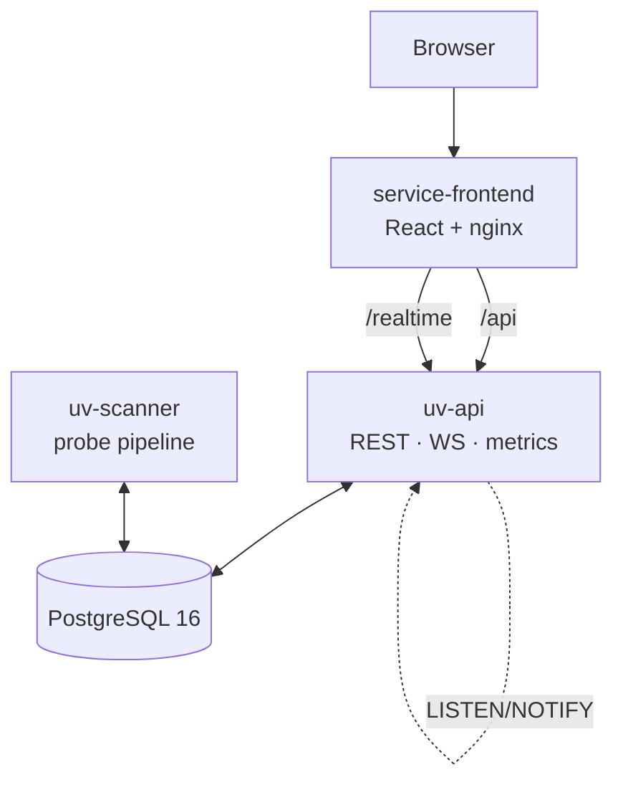

<div align="center">

# UltraViolet

**Self-hosted network discovery & search — your own Shodan, on your hardware.**

TCP/UDP scanning · ~100 protocol probes · TLS/JARM fingerprints · CVE matching · full-text search · delta tracking · alerts

<br/>

[](service-api/)
[](service-frontend/)
[](service-env/)
[](service-env/)
[](.github/workflows/ci.yml)
[](LICENSE)

[Quick start](#-quick-start) ·
[Features](#-features) ·
[Architecture](#-architecture) ·
[Documentation](#-documentation) ·
[Production](#-production-checklist)

</div>

---

> **Important.** Scan only networks you own or have **written authorization** to scan. UltraViolet performs passive service reconnaissance — it does not exploit vulnerabilities.

## Why UltraViolet

| Use case | What you get |
|----------|--------------|
| Perimeter & inventory | Continuous discovery of open ports and services across CIDR ranges |
| Infrastructure search | Full-text search over HTTP bodies, banners, TLS, DNS, and CVEs |
| Risk & compliance | Local NVD matching plus CISA KEV and EPSS — no cloud dependency |
| Air-gapped deployments | Offline archive with Docker images, CVE seed, and GeoIP MMDB on disk |
| Change tracking | Deltas between scans, WebSocket events, alerts on saved searches |

Single tenant, one Docker Compose stack, full control over your data.

## ✨ Features

**Discovery**
- TCP connect scanner with **masscan** or **zmap** as the discovery engine
- UDP probes on configurable ports
- Scoped by `SCAN_ALLOWED_CIDRS` with host and port limits

**Deep probes (~100 protocols)**
- Web: HTTP/HTTPS, HTTP/3, GraphQL, favicon hash, `robots.txt`, `security.txt`, tech stack
- TLS: certificate chains, JARM, JA3S/JA4S, configuration grading
- Mail & directories: SMTP, POP3/IMAP, LDAP, IPMI
- Databases & queues: MySQL, PostgreSQL, MongoDB, Redis, Kafka, MQTT, NATS, AMQP…
- ICS/SCADA: Modbus, BACnet, DNP3, IEC 104, S7Comm, ENIP, OPC UA…
- IoT & media: ONVIF, RTSP, Chromecast, AirPlay, UPnP…
- Full list in the [protocol documentation](service-documentation-frontend/docs/probes/service-protocols.md)

**Enrichment**
- Reverse DNS, GeoIP (MMDB), ASN
- Optional forward DNS and CT-log discovery

**CVE & risk**
- Local NVD mirror with background sync and fingerprint-based matching
- CISA KEV and FIRST EPSS

**Operations**
- RBAC (`viewer` / `operator` / `admin`), JWT + refresh tokens
- Scan schedules, pause/resume, orphan reclaim after worker restart
- Prometheus `/metrics`, optional Grafana profile
- Audit log, rate limiting, retention policies

## 🏗 Architecture



The release UI image proxies `/api/` and `/realtime` to `uv-api` — **single origin**, no frontend rebuild per API URL.

| Directory | Purpose |
|-----------|---------|
| [`service-api/`](service-api/) | Go: `uv-api` (HTTP API, WebSocket, workers) + `uv-scanner` (pipeline) |
| [`service-frontend/`](service-frontend/) | React 19 + Vite + RTK — scans, hosts, search, dashboard |
| [`service-documentation-frontend/`](service-documentation-frontend/) | VitePress — user and operator documentation |
| [`service-env/`](service-env/) | docker-compose, secrets, `install.sh` / `upgrade.sh` / backup |

Backend development rules: [`CLAUDE.md`](CLAUDE.md).

## 🚀 Quick start

**Requirements:** Docker Engine ≥ 24, ~4 GB RAM, Linux **amd64** for production images.

```bash
git clone https://github.com/yakushstanislav/UltraViolet.git
cd UltraViolet/service-env

cp .env.example .env
mkdir -p secrets
openssl rand -hex 32 > secrets/postgres_password
openssl rand -hex 32 > secrets/auth_jwt_secret

cd ..
make dev
```

| URL | Purpose |
|-----|---------|
| http://localhost:3000 | UI (API via nginx `/api/`) |
| http://localhost:8080 | API directly |
| http://localhost:9090/metrics | Prometheus |

**Dev bootstrap:** `admin` / `admin` (only when `APP_ENV≠production`).

## 📖 Documentation

Full guide — VitePress in [`service-documentation-frontend/docs/`](service-documentation-frontend/docs/):

```bash
make docs-dev    # → http://localhost:5173
```

In production, enable the `docs` profile:

```bash
cd service-env && docker compose --profile docs up -d
# → http://localhost:${UV_DOCUMENTATION_PORT:-3002}
```

Key sections: [installation](service-documentation-frontend/docs/getting-started/installation.md) · [scanning](service-documentation-frontend/docs/scanning/) · [API](service-documentation-frontend/docs/api/overview.md) · [deployment](service-documentation-frontend/docs/deployment/docker-compose.md) · [offline install](service-documentation-frontend/docs/deployment/offline-install.md).

## 🛠 Development

### Full Docker

```bash
make dev    # compose prod + dev override, hot-rebuild
```

### Hybrid mode (faster backend iteration)

```bash
make dev-db   # PostgreSQL only on :5432

cd service-api && make build
export LOGGER_NAME=uv-api LOGGER_DEBUG=true
export SERVER_ADDR=0.0.0.0 SERVER_PORT=8080
export METRICS_ADDR=0.0.0.0 METRICS_PORT=9090
export REALTIME_ADDR=0.0.0.0 REALTIME_PORT=8081
export POSTGRES_ADDR=localhost POSTGRES_PORT=5432
export POSTGRES_USERNAME=ultraviolet
export POSTGRES_PASSWORD="$(cat ../service-env/secrets/postgres_password)"
export POSTGRES_DATABASE=ultraviolet
export POSTGRES_SCHEMA_PATH="$(pwd)/deploy/migrations"
export AUTH_JWT_SECRET="$(cat ../service-env/secrets/auth_jwt_secret)"
./bin/uv-api
```

Frontend: `cd service-frontend && npm run dev` (Vite proxies `/api` → `:8080`, `/realtime` → `:8081`).

### GeoIP & CVE

```bash
cd service-env && make geoip-download      # IPLocate MMDB → geoip/
make -C service-env cve-catalog-dump       # CVE dump (requires running postgres)
```

### Build without Docker

```bash
make build && make lint && make frontend-build && make docs-build
```

## 📦 Release & installation

**Target platform:** `linux/amd64`. On Apple Silicon, set `DOCKER_PLATFORM=linux/amd64` for offline archives.

```bash
git tag v0.1.0
make release VERSION=v0.1.0
make release-promote VERSION=v0.1.0   # :latest — separate step
```

| Archive | Contents |
|---------|----------|
| `ultraviolet-vX.Y.Z.tar.gz` | compose, scripts, `.env.example` (~50 KB, online) |
| `ultraviolet-vX.Y.Z-offline.tar.gz` | + amd64 Docker images |
| `ultraviolet-vX.Y.Z-offline-full.tar.gz` | + CVE seed + GeoIP MMDB |

**Online:** extract → `cp .env.example .env` → `./install.sh` (pull from registry).

**Offline:** `./install.sh` (`docker load`, no pull). Upgrade: keep `.env`, `secrets/`, and the Postgres volume → `./upgrade.sh`.

Variables: `UV_REGISTRY` (default `docker.io/ultraviolet`), `DRY_RUN=1` — local smoke build without push.

<details>
<summary><strong>Offline installation — step by step</strong></summary>

```bash
# from the build machine
scp dist/ultraviolet-v0.1.0-offline.tar.gz user@host:~/

# on the server (Docker ≥ 24, amd64)
tar xzf ultraviolet-v0.1.0-offline.tar.gz && cd ultraviolet-v0.1.0
cp .env.example .env
./install.sh
```

Upgrade (preserve data):

```bash
docker compose -f docker-compose.yml down
# back up .env + secrets/, extract the new archive, run ./upgrade.sh
```

Keep the directory name (`ultraviolet-v0.1.0`) stable — the `postgres-data` Docker volume is tied to it.

</details>

## ✅ Production checklist

1. Store secrets in `secrets/`, never in git.
2. Set `CORS_ALLOWED_ORIGINS` to real UI origins only.
3. Configure `SCAN_ALLOWED_CIDRS` and host/port limits.
4. Change the bootstrap password and `AUTH_JWT_SECRET` (`install.sh` rejects placeholders).
5. Set `APP_ENV=production` — uv-api refuses `admin/admin` and passwords shorter than 8 characters.
6. Terminate TLS at a reverse proxy — example: [`service-env/examples/nginx-tls.conf`](service-env/examples/nginx-tls.conf).
7. Behind a proxy: set `AUDIT_TRUST_PROXY_HEADERS=true`.
8. Back up PostgreSQL: [`service-env/scripts/backup.sh`](service-env/scripts/backup.sh) + cron; `upgrade.sh` also creates a dump.
9. Metrics at `:9090/metrics`; Grafana via the `observability` profile.
10. Refresh GeoIP: [`service-env/scripts/geoip-refresh.sh`](service-env/scripts/geoip-refresh.sh) on a monthly cron.

<details>
<summary><strong>HTTPS, sub-path deploy, backup cron</strong></summary>

**TLS termination on external nginx** — bind the UI to loopback only:

```yaml
# docker-compose.override.yml
services:
  service-frontend:
    ports:
      - "127.0.0.1:3000:8080"
```

```bash
CORS_ALLOWED_ORIGINS=https://ultraviolet.example.com
AUDIT_TRUST_PROXY_HEADERS=true
```

**Sub-path** (`/ultraviolet/`):

```bash
VITE_BASE_PATH=/ultraviolet/ make frontend-build
# UV_BASE_PATH=/ultraviolet/ in compose — must match VITE_BASE_PATH
```

**Backup cron** (daily, 14-day retention):

```cron
0 3 * * * cd /opt/ultraviolet/service-env && ./scripts/backup.sh && find backups -name 'uv-*.dump' -mtime +14 -delete
```

**GeoIP refresh** (1st of each month):

```cron
0 4 1 * * cd /opt/ultraviolet/service-env && ./scripts/geoip-refresh.sh >> /var/log/uv-geoip.log 2>&1
```

</details>

## 🔐 API & RBAC

After `POST /v1/auth/login` you receive an `access_token` (Bearer) and `refresh_token` (`/v1/auth/refresh`).

| Role | Capabilities |
|------|--------------|
| `viewer` | Read hosts, search, CVEs, dashboard |
| `operator` | + start and manage scans |
| `admin` | + users, audit, settings |

`GET /v1/me` · `GET /v1/version` · `GET /readyz` (health + version + commit).

## 🤝 Contributing

See [CONTRIBUTING.md](CONTRIBUTING.md). Security reports: [SECURITY.md](SECURITY.md).
Community standards: [CODE_OF_CONDUCT.md](CODE_OF_CONDUCT.md).

## 📄 License

UltraViolet is released under the [MIT License](LICENSE).

---

<p align="center">
  <sub>UltraViolet — discover what you own, understand what changed, keep it on your network.</sub>
</p>
